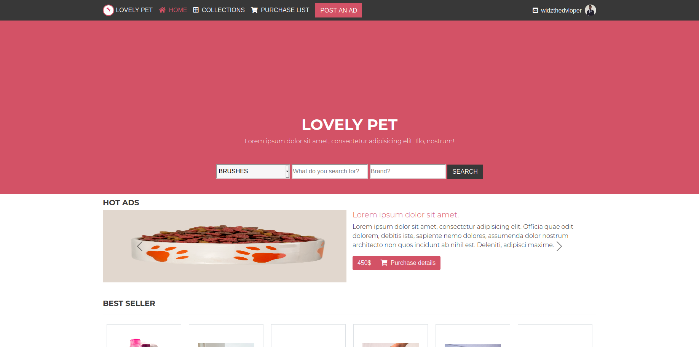
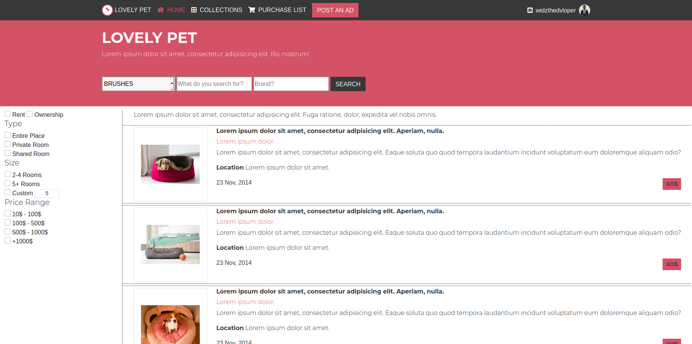

# OnlineShop
This is an online shop for pet utensils. In this online shop, two pages constitute the website. the first one, the main page, laid out the different categories of products including the most selling products and the ultimate page is the search result.
Disclaimer: the original design is from 👤**Mohammed Awad** on Behance [Link Of the Design](https://www.behance.net/gallery/24796463/ZATTIX)

# Getting started :
This website has been designed for two screen size, small up to 767px.You can download the repo and open the "index.html" file with Mozilla Firefox or google Chrome or any browser you may choose.

# Main Page

# Result Page Or COLLECTIONS

## BUILT WITH

    -HTML
    -CSS
    -bootstrap
    -jquery & javascript (downloaded with bootstrap).

## LIVE DEMO

[Live Demo Link](https://widzthedvloper.github.io/OnlineShop/)

##  AUTHORS

👤 **Widzmarc Jean Nesly Phelle**

- GitHub: [@githubhandle](https://github.com/widzthedvloper)
- Twitter: [@twitterhandle](https://twitter.com/widzthedvloper)
- LinkedIn: [LinkedIn](https://www.linkedin.com/in/widzmarc-jean-nesly-phelle-252a26129/)

## SHOW YOUR SUPPORT
Give a :star: if you like this project.

## 📝 LICENSE
MIT
